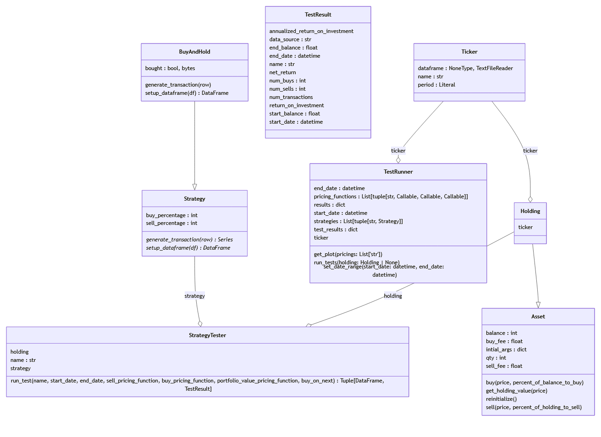

# Backtester Lib

This is a backtesting library used to rigorously backtest trading strategies within a flexible framework.

Initially inspired by a casual discussion during a Brazilian Jiu-Jitsu class, this project has evolved from a simple script to a robust Python package designed for traders and developers alike.

## Features

- Comprehensive backtesting framework to evaluate trading strategies.
- Custom strategy definition and testing.
- Customizable trading fees and dataset compatibility.
- Efficient retrieval of key metrics from test results.

## Technology Stack

- **Programming Language** : Python
- **Libraries**: Pandas, Numpy, Scipy, Dask, Matplotlib
- **Tools**: Jupyter Notebook

## Quickstart

Refer to the [HowToUse.ipynb](./HowToUse.ipynb) for detailed instructions. Below is a quick setup to get started:

```python
# Example of initializing and running a backtest
from datetime import datetime
from backtester_lib.strategies.buy_and_hold import BuyAndHold
from backtester_lib.strategy_tester import StrategyTester
from backtester_lib.assets.holding import Holding
from backtester_lib.utils import open_pricing
from backtester_lib.ticker import Ticker

# Setup data and parameters
data_csv = "./data/btcData1d.csv"
ticker = Ticker("ticker", data_csv, "4hr")
holding = Holding(ticker)

# Create or use your strategy
test_strat = BuyAndHold()

# Run your backtest
dataframe and TestResult Object
test_name = "buy_and_hold_test"
test, test_result = StrategyTester(
    "buy_and_hold", test_strat, holding
).run_test(
    name=test_name,
    start_date=datetime(2022, 9, 1),
    end_date=datetime(2024, 11, 1),
    buy_pricing_function=open_pricing,
    sell_pricing_function=open_pricing,
)
```

## Future Feature Ideas

- **Increase Computational Efficiency**: Optimize algorithms to enhance processing speed and handle larger datasets more efficiently.
- **Parallelize Tests Natively in the Library**: Implement native support for parallel testing to significantly reduce backtesting time and improve performance on multi-core systems.
- **Create a Database for Test Histories**: Develop a structured database to store historical test data, including strategies, parameters, and results, enabling better tracking and analysis over time.
- **Add a Simple GUI**: Introduce a user-friendly graphical interface to make the library accessible to non-programmers and enhance user interaction.

## History of the project

### Origins

The idea for Backtester Lib originated from a casual conversation about coding projects during a Brazilian Jiu Jitsu class with my friend Ryan aka [Jawwastar](https://github.com/jawwastar). Intrigued by Jawwastar's initial R script for trading strategy verification, I saw potential for a robust development and decided to join the project.

### The Original R Script and Python Transition

Jawwastar had developed a prototype trading strategy using ChatGPT, but struggled with scaling it. I translated this into Python to verify the strategy’s effectiveness, leveraging my strong Python skills to enhance and expand the initial script.

### Advancing to Python and Jupyter Notebooks

To accommodate Jawwastar’s familiarity with R, I created the [HowToUse.ipynb](./HowToUse.ipynb) notebook, serving as a bridge for him to Python. This notebook initially housed all our strategies and ideas, becoming the foundation of our project’s development.

### Migration to Functions and Frameworks

As our strategies evolved, the need for consistency and reliability became evident. Transitioning from Jupyter notebooks to a functional programming approach, we developed reusable functions that later evolved into a class-based framework, separating strategy development from execution.

### Refinement and Parallel Testing

With the framework in place, we introduced a test runner to handle strategy assessments across various conditions. The test runner, parallelized using Dask, allowed us to efficiently compare different strategies on similar datasets.

### Development Hiatus

Despite successful personal investment returns, the strategies did not meet institutional investment criteria. Following extensive testing and consultations with industry experts, we decided to pause development, reflecting on the project’s scalability and market fit.

## Lessons Learned

Throughout the development of Backtester Lib, we learned the importance of modularization and proactive bug testing, which could have saved significant time. Although there were existing tools available, building our own provided invaluable learning and was incredibly rewarding. We also recognized the value of working solutions over perfection and the importance of clean, iterative design in software development.

## Skills Used

Our project utilized advanced concepts like Object-Oriented Design and Computational Optimization, employing tools such as Python, Jupyter, and various data science libraries. On a personal development level, the project enhanced our abilities in teaching, training, and technical communication, proving to be a comprehensive skill-building endeavor.

## Class Diagram

Generated with [pyreverse](https://pylint.pycqa.org/en/latest/additional_tools/pyreverse/index.html)

### Class Diagram


